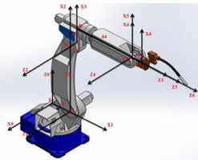
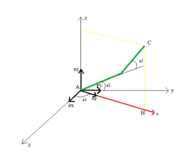
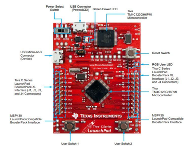
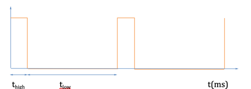
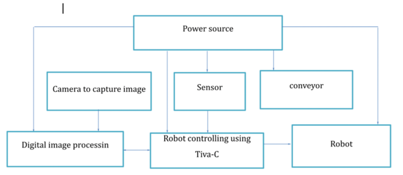
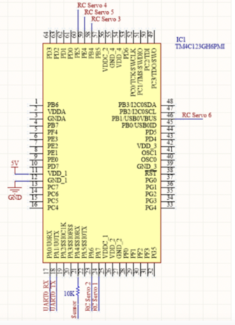

# Embedded programming project for Arm Robot controlling with Tiva-C Micro-Controller

## 1. Purpose
This project is program for the embedded-based application to control 6 DOF Arm Robot

## 2.Devices introduction
### Robot overview

### Mechanical theory

Tiva-C Laundpad Kit (use as the Center Micro-controller)

### PWM pulse (use to control the Servo engine)

## 3.System architecture
### Hardware workflow

### Micro-controller connect to sensor and devices

## 4.Usage
+ Design the 3D Robot based on the image
+ Design the Tiva C Controller to control the robot
+ Build the binary file from the source code (Code Compiler Studio software is recommended for this compile)
+ Embed the built binary to the Tiva-C micro controller
+ Experiment and observe the result
